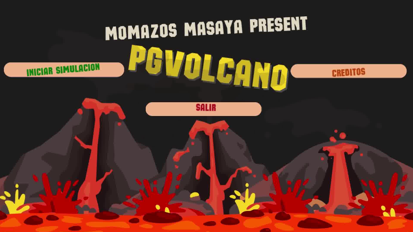
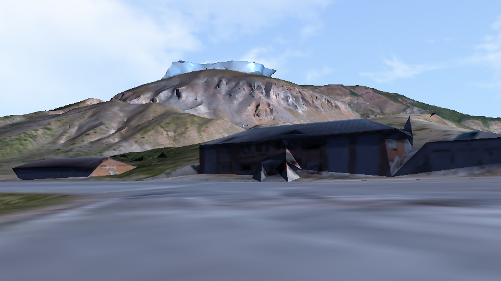
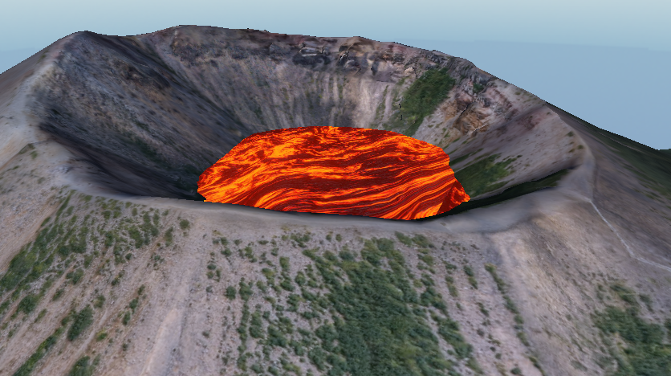
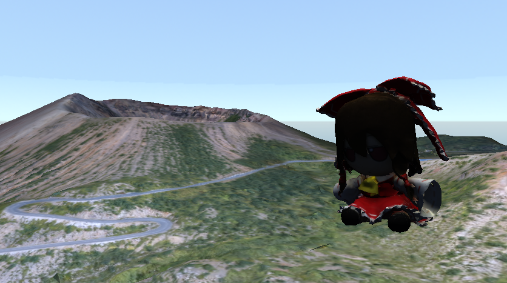

# 🌋 Volcanic Eruption Simulator


---

## Description

This project is an interactive 3D simulation of a volcanic eruption developed using C++ and OpenGL. The simulation features:

- A fully rendered 3D terrain
- Realistic lava particle effects and smoke
- Animated lava rivers flowing down slopes
- A jumpable cube-character with basic physics and terrain collision
- An animated image-based main menu
- Ambient sounds and eruption audio using irrKlang
- A FreeType-based system for rendering text on screen (menus, HUD)
- Skybox environment for immersive atmosphere

The project showcases various OpenGL techniques including shaders, VBO/VAO handling, model loading, and texture animation.

---

## Features

- 🌋 Dynamic lava eruption system with rising lava and eruption control
- 🧊 Particle system: lava projectiles that bounce off terrain
- 🌊 Flowing lava rivers that activate after eruption
- 🧍 Controllable character (cube) with gravity and jumping
- 🧭 Animated main menu with clickable buttons
- 🔊 Background music and sound effects
- 🌌 Custom skybox textures for environment
- 📝 In-game text using FreeType

---

## Requirements

- C++17
- OpenGL 4.6
- GLFW
- GLAD
- stb_image
- FreeType
- irrKlang (audio)
- Visual Studio 2019 or 2022

---

## How to Run

1. **Clone the repository:**

   ```bash
   git clone https://github.com/yourusername/volcano-simulator.git
   cd volcano-simulator
2. **Open the solution file (.sln) in Visual Studio Community 2019 or 2022.**

3. **Build the project (Debug).**

4. **Run the executable either directly from Visual Studio or from the /x64/Debug.**

This project was designed to run immediately after cloning, as long as all required libraries (GLFW, GLAD, FreeType, irrKlang, stb_image, etc.) are already correctly configured and available on your system or included in the project folder.

Make sure any required .dll files (e.g., glfw3.dll, irrKlang.dll) are located in the same directory as your final executable to avoid runtime errors.

License
This project is for educational purposes. All models, textures, and audio used are under their respective licenses.

Authors
## 👥 Authors

- **Potoy Sebastian Ernesto** – Terrain modeling and rendering – [@Sebastianpt1](https://github.com/Sebastianpt1)
- **Vega Cruz Wilmor José** – Lava particles, lava rivers, shaders, eruption logic – [@wilmor03](https://github.com/wilmor03)
- **Montiel Acevedo Juan Francisco** – Cube character, physics, terrain collision – [@Juanff7](https://github.com/Juanff7)
- **Castillo Cano Agustín Manuel** – Animated main menu, transitions, user input – [@CCano626](https://github.com/CCano626)

## 📷 Screenshots








